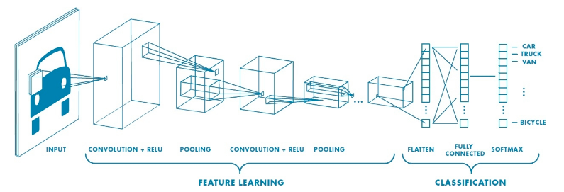
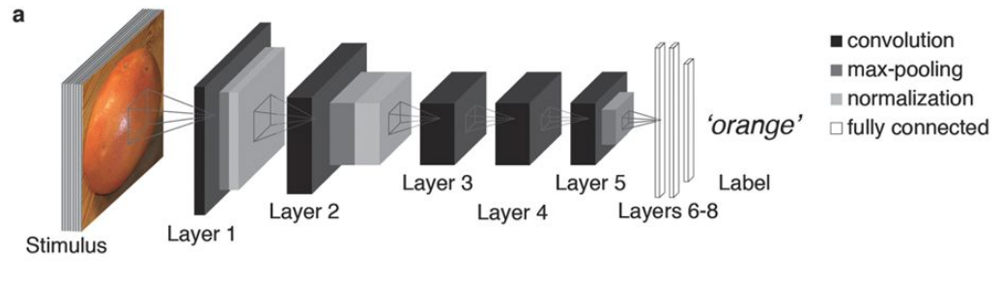
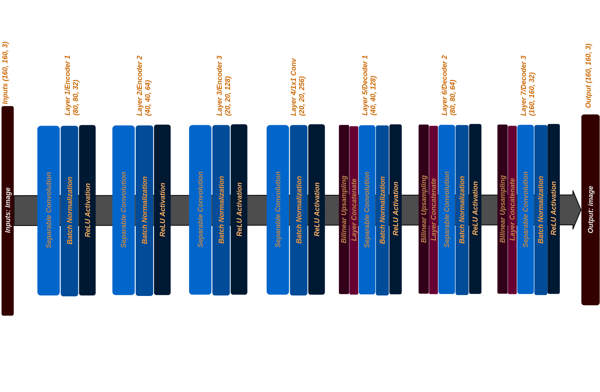

[](https://www.udacity.com/robotics)

# Deep Learning Project
## Author: Tuan Le
## Date: July 2018

This repository contains code and data of a fully convolutional network that is used to identify and track a target in a simulation environment. Also, I will briefly explain working principle of a deep neural network and convolutional neural network. Finally, I will show results of after training a network to recognize a target.

# 1. Fully Convolutional Neural Network

A fully Convolution Neural Network (**FCN**) consists of a Convolutional Neural Network (**CNN**) which scan through an image to extract features and, thus, create a deep neural network. This deep neural network will be used in objects classification. A typical **CNN** is illustrate below.

<p align="center"></p>

Just like the above image, an architecture of a **CNN** usually has an ***input***, ***convolutional layers (Feature Learning)***, and ***a deep neural network (Classification)***. The convolutional layers play a role of learning features of an image through multiple time until they produces a final high-abstract layer. Then, the high-abstract layer will be fed into a deep neural network to start the classification process.

Each layer in the convolutional layers has many sub-layer. More detail show below.

<p align ="center"></p>


# 2. Hardware and Software Used
In this project, I used Amazon Web Service EC2 instance to train my network.
* **Instance type**: p2.xlarge instance
* **AMI**: Udacity Robotics Deep Learning Laboratory
* **CPU specification**: 4 x Intel(R) Xeon(R) E5-2686 v4 @ 2.30GHz
* **GPU specification**: NVIDIA Tesla K80 (1xGK210GL with 12GB Memory & 2496 CUDA cores)

I linked to the AWS instance and perform training through the Jupyter Notebook.

# 3. Data Recording
I am using the data provided by Udacity course. Here is a summary table of the data directory.
<table><tbody>
    <tr><th align="center" colspan="3"><span style="color:darkblue">Data Set</span></td></tr>
    <tr><th align="center"><span style="color:darkblue">Directory</span></th><th align="center"><span style="color:darkblue">Content</span></th></tr>
    <tr><td align="left">/data/**train**</td><td align="left">**4,131** images and **4,131 masks**</td></tr>
    <tr><td align="left">/data/**validation**</td><td align="left">**1,184** images and **1,184** masks</td></tr>
    <tr><td align="left">/data/sample_evalution_data/**following_images**</td>
       <td align="left">**542** images and **542** masks</td></tr><tr>
    <td align="left">/data/sample_evalution_data/**patrol_non_targ**</td>
       <td align="left"> **270** images and **270** masks</td></tr><tr>
    <td align="left">/data/sample_evalution_data/**patrol_with_targ**</td>
       <td align="left"> **322** images and **322** masks</td></tr>
    <td align="left">/data/**weights**</td>
       <td align="left">  **6** model weights and configuration files </td></tr>
</tbody></table>

# 4. Project Implementation
## 4.1 Code
#### My Fully Convolutional Network


#### Separable Convolutions

Each includes batch normalization with the **ReLU** activation function applied to the layers.

```python
def separable_conv2d_batchnorm(input_layer, filters, strides=1):
    output_layer = SeparableConv2DKeras(filters=filters,kernel_size=3, strides=strides,
                             padding='same', activation='relu')(input_layer)

    output_layer = layers.BatchNormalization()(output_layer)
    return output_layer

def conv2d_batchnorm(input_layer, filters, kernel_size=3, strides=1):
    output_layer = layers.Conv2D(filters=filters, kernel_size=kernel_size, strides=strides,
                      padding='same', activation='relu')(input_layer)

    output_layer = layers.BatchNormalization()(output_layer)
    return output_layer
```
#### Bilinear Upsampling

This function helps to upsampling data during decode process in **FCN**. Here, I used a factor of 2 to upsampling data.

```python
def bilinear_upsample(input_layer):
    output_layer = BilinearUpSampling2D((2,2))(input_layer)
    return output_layer
```
#### Encoder

The encoder reduces the size and increase the depth of the input layer according to **filter** and **strides** value.

**Explain the formula here**

```python
def encoder_block(input_layer, filters, strides):

    # TODO Create a separable convolution layer using the separable_conv2d_batchnorm() function.
    output_layer = separable_conv2d_batchnorm(input_layer, filters, strides)
    return output_layer
```

#### Decoder

On the other hand, the decoder block increases the size and reduce the depth of the input layer. It is the opposite with encoder. There are three part in this function.
* A bilinear upsampling layer
* A layer concatenate step. This likes the skip connection as mentioned above.
* Some additional separable convolution layers to extract more spatial information from prior layer.

```python
def decoder_block(small_ip_layer, large_ip_layer, filters):

    # TODO Upsample the small input layer using the bilinear_upsample() function.
    upsample = bilinear_upsample(small_ip_layer)

    # TODO Concatenate the upsampled and large input layers using layers.concatenate
    concatenate = layers.concatenate([upsample, large_ip_layer])

    # TODO Add some number of separable convolution layers
    output_layer = separable_conv2d_batchnorm(concatenate, filters, strides=1)

    return output_layer
```
#### Model

Here, I created **three** layers of encoder and **three** layers of decoder for the network to learning enough features. At the final output layer, I used the softmax activation function to convert the outputs of the final layer to probability values of each class.

```python
def fcn_model(inputs, num_classes):

    # TODO Add Encoder Blocks.
    print("inputs:", inputs.shape)
    # Remember that with each encoder layer, the depth of your model (the number of filters) increases.
    layer_1 = encoder_block(inputs, 32, 2)
    print("layer_1:", layer_1.shape)

    layer_2 = encoder_block(layer_1, 64, 2)
    print("layer_2:", layer_2.shape)

    layer_3 = encoder_block(layer_2, 128, 2)
    print("layer_3:", layer_3.shape)

    # TODO Add 1x1 Convolution layer using conv2d_batchnorm().
    layer_4 = conv2d_batchnorm(layer_3, 256, 1, 1)
    print("layer_4:", layer_4.shape)

    # TODO: Add the same number of Decoder Blocks as the number of Encoder Blocks
    layer_5 = decoder_block(layer_4, layer_2, 128)
    print("layer_5:", layer_5.shape)

    layer_6 = decoder_block(layer_5, layer_1, 64)
    print("layer_6:", layer_6.shape)

    layer_7 = decoder_block(layer_6, inputs, 32)
    print("layer_7:", layer_7.shape)

    # The function returns the output layer of your model. "x" is the final layer obtained from the last decoder_block()
    outputs = layers.Conv2D(num_classes, 1, activation='softmax', padding='same')(layer_7)
    print("outputs shape:", outputs.shape)

    return outputs
```

A summary of all layers shape:

```text
inputs shape (?, 160, 160, 3)
layer_1 shape (?, 80, 80, 32)
layer_2 shape (?, 40, 40, 64)
layer_3 shape (?, 20, 20, 128)
layer_4 shape (?, 20, 20, 256)
layer_5 shape (?, 40, 40, 128)
layer_6 shape (?, 80, 80, 64)
layer_7 shape (?, 160, 160, 32)
outputs shape: (?, 160, 160, 3)
```

<p align="center"></p>

## 4.2 Hyper Parameters
#### Batch Size
#### Learning Rate
#### Number of Epochs
#### Step per Epoch
#### Workers
#### Validation Steps

## 4.3 Prediction
#### With-target Patrol
#### Without-target Patrol
#### Distance Detection with Target

## 4.4 Evaluation and Scoring
## 4.5 Testing in Simulation
# 5. Future Enhancements
