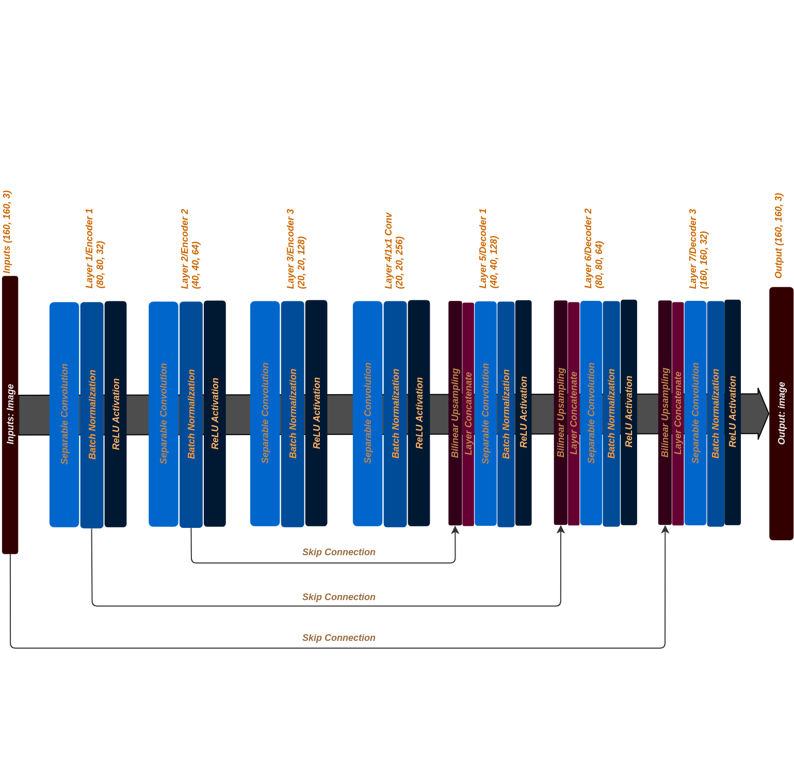
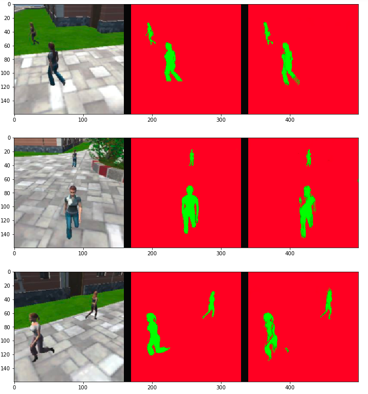

[](https://www.udacity.com/robotics)

# Deep Learning Project
## Author: Tuan Le
## Date: July 2018

This repository contains code and data of a fully convolutional network that is used to identify and track a target in a simulation environment. Also, I will briefly explain working principle of a deep neural network and convolutional neural network. Finally, I will show results of after training a network to recognize a target.

# 1. Fully Convolutional Neural Network

#### Convolutional Neural Network Architecture

A fully Convolution Neural Network (**FCN**) consists of a Convolutional Neural Network (**CNN**) which scan through an image to extract features and, thus, create a deep neural network. This deep neural network will be used in objects classification. A typical **CNN** is illustrate below.

<p align="center"></p>

Just like the above image, an architecture of a **CNN** usually has an ***input***, ***convolutional layers*** (Feature Learning), and ***a deep neural network*** (Classification). The convolutional layers play a role of learning features of an image through multiple time until they produces a final high-abstract layer. Then, the high-abstract layer will be fed into a deep neural network to start the classification process.

Each layer in the convolutional layers has many sub-layers. More detail show below.

<p align ="center"></p>

These sub-layers normally include **convolution**, **max pooling**, and **normalization**.

##### Convolution Sub-layer

Each image contains a structured like this. Height, width, and three channels of color as a depth dimension of an input layer.

<p align="center"></p>

The convolution sub-layer is the output of convolute operation on prior layer/input image. The shape of Convolution sub-layer is calculated based on **size of a kernel**, **the number of kernel**, **padding type** and **stride**.


<p align="center"></p>

+ `W_out`, `H_out` and `D_out` is the dimension of the output layer.
+ `W_in`, `H_in`, and `D_in` is the dimension of the input layer.
+ `F` is the **kernel/filter size**. For example, a kernel of size 1x1, then F = 1.
+ `P` is **padding type**. The ***valid*** padding type will result to 1 and the ***same*** padding type is 0.
+ `S` is the **stride** value. Stride 1 will have S = 1.
+ `K` is **the number of kernel/filter**.


##### Max Pooling Sub-layer

<p align="center"></p>

+ Max pooling operation is similar to convolution operation at which it has a kernel/filter of size **x**. The kernel scans across the convolution sub-layer and pick out the maximum value.

+ Pooling reduces the spatial dimension (width and height) but does not affect the depth.

+ This is also called **down sampling** operation during an encoding process in **FCN**.

##### Normalization Sub-layer
Normalization sub-layer has ReLU to convert images to non-linear data. With ReLU all negative numbers will become zero; therefore, it creates a stack of images with no negative values.

#### When to and Why use FCN

<p align="center"></p>

Normally, a convolutional neural network (CNN) has done a good job in classify a object through scanning that object image. However, when there is more than one object in an image, CNN fails to recognise a expected object due to not reserving spatial information.

The FCN can overcome this challenge by introducing the 1x1 convolution layer, encoder/decoder, and skip connection. Skip connection allows an FCN to use information from previous layer to recognise where is the expected object in an image. 1x1 convolution layer reserve spatial information. Decoder upsamples image data. Since FCN helps recognise the expected object regardless of its location in any image, FCN is usually used for semantic segmentation.

#### 1x1 Convolution
During down sampling/encoder process, there are some spatial information may loss on the way. A 1x1 convolution transfers all spatial information from an input layer to output layer without reducing the size. In other words, 1x1 convolution prevent loss in spatial information.

#### Reasons to use Encoder/Decoder of FCN
In CNN, the encoder process tries to capture detail features of an object such as ears, eyes, or noses of a dog. This will be then used to recognise a dog but miss out a bigger picture when there are multiple objects. In real life scenarios, there is not only one objects but many. Therefore, the decoder has come to play an important role in distinguishing the desired object from undesired ones.

The decoder process (or **Transposed Convolution**) unconvolutes a prior input (with abstracted details) into a richer spatial information output. The decoder process is similar to the encoder which needs following parameters; **size of a kernel**, **the number of kernel**, **padding type** and **stride**. These parameters determine the shape of the output. The picture below illustrate a simple process of using `VALID` padding type to deconvolute.

<p align="center"></p>

# 2. Hardware Used
In this project, I used Amazon Web Service EC2 **(AWS)** instance as the hardware part to train my network.
* **Instance type**: p2.xlarge instance
* **AMI**: Udacity Robotics Deep Learning Laboratory
* **CPU specification**: 4 x Intel(R) Xeon(R) E5-2686 v4 @ 2.30GHz
* **GPU specification**: NVIDIA Tesla K80 (1xGK210GL with 12GB Memory & 2496 CUDA cores)

I linked to the AWS instance and perform training through the Jupyter Notebook.

# 3. Data Recording
I am using the data provided by Udacity course. Here is a summary table of the data directory.
<table><tbody>
    <tr><th align="center" colspan="3"><span style="color:darkblue">Data Set</span></td></tr>
    <tr><th align="center"><span style="color:darkblue">Directory</span></th><th align="center"><span style="color:darkblue">Content</span></th></tr>
    <tr><td align="left">/data/<b>train</b></td><td align="left"><b>4,131</b> images and <b>4,131</b> masks</td></tr>
    <tr><td align="left">/data/<b>validation</b></td><td align="left"><b>1,184</b> images and <b>1,184</b> masks</td></tr>
    <tr><td align="left">/data/sample_evalution_data/<b>following_images</b></td>
       <td align="left"><b>542</b> images and <b>542</b> masks</td></tr><tr>
    <td align="left">/data/sample_evalution_data/<b>patrol_non_targ</b></td>
       <td align="left"> <b>270</b> images and <b>270</b> masks</td></tr><tr>
    <td align="left">/data/sample_evalution_data/<b>patrol_with_targ</b></td>
       <td align="left"> <b>322</b> images and <b>322</b> masks</td></tr>
    <td align="left">/data/<b>weights</b></td>
       <td align="left">  <b>6</b> model weights and configuration files </td></tr>
</tbody></table>

# 4. Project Implementation
## 4.1 Code
#### My Fully Convolutional Network

<p align="center"></p>

#### Separable Convolutions

Each includes batch normalization with the **ReLU** activation function applied to the layers.

```python
def separable_conv2d_batchnorm(input_layer, filters, strides=1):
    output_layer = SeparableConv2DKeras(filters=filters,kernel_size=3, strides=strides,
                             padding='same', activation='relu')(input_layer)

    output_layer = layers.BatchNormalization()(output_layer)
    return output_layer

def conv2d_batchnorm(input_layer, filters, kernel_size=3, strides=1):
    output_layer = layers.Conv2D(filters=filters, kernel_size=kernel_size, strides=strides,
                      padding='same', activation='relu')(input_layer)

    output_layer = layers.BatchNormalization()(output_layer)
    return output_layer
```
#### Bilinear Upsampling

This function helps to upsampling data during decode process in **FCN**. Here, I used a factor of 2 to upsampling data.

```python
def bilinear_upsample(input_layer):
    output_layer = BilinearUpSampling2D((2,2))(input_layer)
    return output_layer
```
#### Encoder

The encoder reduces the size and increase the depth of the input layer according to **filter** and **strides** value.

**Explain the formula here**

```python
def encoder_block(input_layer, filters, strides):

    # TODO Create a separable convolution layer using the separable_conv2d_batchnorm() function.
    output_layer = separable_conv2d_batchnorm(input_layer, filters, strides)
    return output_layer
```

#### Decoder

On the other hand, the decoder block increases the size and reduce the depth of the input layer. It is the opposite with encoder. There are three part in this function.
* A bilinear upsampling layer
* A layer concatenate step. This likes the skip connection as mentioned above.
* Some additional separable convolution layers to extract more spatial information from prior layer.

```python
def decoder_block(small_ip_layer, large_ip_layer, filters):

    # TODO Upsample the small input layer using the bilinear_upsample() function.
    upsample = bilinear_upsample(small_ip_layer)

    # TODO Concatenate the upsampled and large input layers using layers.concatenate
    concatenate = layers.concatenate([upsample, large_ip_layer])

    # TODO Add some number of separable convolution layers
    output_layer = separable_conv2d_batchnorm(concatenate, filters, strides=1)

    return output_layer
```
#### Model

Here, I created **three** layers of encoder and **three** layers of decoder for the network to learning enough features. At the final output layer, I used the softmax activation function to convert the outputs of the final layer to probability values of each class.

```python
def fcn_model(inputs, num_classes):

    # TODO Add Encoder Blocks.
    print("inputs:", inputs.shape)
    # Remember that with each encoder layer, the depth of your model (the number of filters) increases.
    layer_1 = encoder_block(inputs, 32, 2)
    print("layer_1:", layer_1.shape)

    layer_2 = encoder_block(layer_1, 64, 2)
    print("layer_2:", layer_2.shape)

    layer_3 = encoder_block(layer_2, 128, 2)
    print("layer_3:", layer_3.shape)

    # TODO Add 1x1 Convolution layer using conv2d_batchnorm().
    layer_4 = conv2d_batchnorm(layer_3, 256, 1, 1)
    print("layer_4:", layer_4.shape)

    # TODO: Add the same number of Decoder Blocks as the number of Encoder Blocks
    layer_5 = decoder_block(layer_4, layer_2, 128)
    print("layer_5:", layer_5.shape)

    layer_6 = decoder_block(layer_5, layer_1, 64)
    print("layer_6:", layer_6.shape)

    layer_7 = decoder_block(layer_6, inputs, 32)
    print("layer_7:", layer_7.shape)

    # The function returns the output layer of your model. "x" is the final layer obtained from the last decoder_block()
    outputs = layers.Conv2D(num_classes, 1, activation='softmax', padding='same')(layer_7)
    print("outputs shape:", outputs.shape)

    return outputs
```

A summary of all layers shape:

```text
inputs shape (?, 160, 160, 3)
layer_1 shape (?, 80, 80, 32)
layer_2 shape (?, 40, 40, 64)
layer_3 shape (?, 20, 20, 128)
layer_4 shape (?, 20, 20, 256)
layer_5 shape (?, 40, 40, 128)
layer_6 shape (?, 80, 80, 64)
layer_7 shape (?, 160, 160, 32)
outputs shape: (?, 160, 160, 3)
```

## 4.2 Hyper Parameters
#### Batch Size
Batch size is the number of training samples/images will be passed through a FCN. I tried to use small batch (e.g. 20 and 30) on my laptop but the laptop CPU was overloaded. I have to use AWS instance to train my network. AWS instance specification has listed above and is powerful enough to train with large batch size.

I carried out three training with two different batch size (**110** and **120**). I chosed these values depend on AWS instance CPU computational capacity and training time.

#### Learning Rate
Learning rate controls the network weights adjustment with respect to loss gradient. In other word, it is how fast for a network to converge at the minium loss during a gradient descent operation.

I have experiment with several learning rate (**0.15**, **0.1**, **0.01**, **0.001**) and found the best range is between **0.01 and 0.001**.

#### Number of Epochs
An epoch is the time for a sample batch feed forward and backward once. The more the number of epoch the more accurate that network will be. After experiment with a variety of values, I found that with the learning rate between 0.01 and 0.001, the network converge quickly after 20 epochs. Therefore, I chose the number of epoch is **100** to have an accurate network but is not over trained.

#### Step per Epoch
Step per epoch is determined by the batch size and the number of training sample. With the training data set above (4131 images) and the batch size of 120, step per epoch is approximately 35.

The formula is shown below:
<p align="center"></p>

#### Validation Steps
Same with the step per epoch parameter, the batch size and the number of validation sample decide the number of step.
<p align="center"></p>

#### Workers
Workers is the maximum number of processor to be used. In the case of the AWS instance, there are maximum of **4** CPU cores. I used all of them to train my network.

#### Summary of Trainings

<table><tbody>
    <tr><th align="center" colspan="3">Parameters Set 1</td></tr>
    <tr><th align="center" colspan="3"></th></tr>
    <tr><th align="center">Parameter</th><th align="center">Value</th></tr>
    <tr><td align="left">Learning Rate</td>   <td align="center">0.01</td></tr>
    <tr><td align="left">Batch Size</td>      <td align="center">110</td></tr>
    <tr><td align="left">Epoch Number</td>    <td align="center">50</td></tr>
    <tr><td align="left">Steps per Epoch</td> <td align="center">38</td></tr>
    <tr><td align="left">Validation Steps</td><td align="center">50</td></tr>
    <tr><td align="left">Workers</td>         <td align="center">4</td></tr>
    <tr><td align="left">Train Loss</td>      <td align="center">0.0103</td></tr>
    <tr><td align="left">Validation Loss</td> <td align="center">0.0285</td></tr>
    <tr><td align="left">Final Score</td>     <td align="center">0.403539736664</td></tr>
    <tr>
    <td align="center"><a href="./data/weights/config_model_weights_01">Model Configuration</a></td>
    <td align="center"><a href="./data/weights/model_weights_01">Model Weights</a></td>
    </tr>
</tbody></table>

<table><tbody>
    <tr><th align="center" colspan="3">Parameters Set 2</td></tr>
    <tr><th align="center" colspan="3"></th></tr>
    <tr><th align="center">Parameter</th><th align="center">Value</th></tr>
    <tr><td align="left">Learning Rate</td>   <td align="center">0.1</td></tr>
    <tr><td align="left">Batch Size</td>      <td align="center">80</td></tr>
    <tr><td align="left">Epoch Number</td>    <td align="center">100</td></tr>
    <tr><td align="left">Steps per Epoch</td> <td align="center">52</td></tr>
    <tr><td align="left">Validation Steps</td><td align="center">15</td></tr>
    <tr><td align="left">Workers</td>         <td align="center">4</td></tr>
    <tr><td align="left">Train Loss</td>      <td align="center">0.0116</td></tr>
    <tr><td align="left">Validation Loss</td> <td align="center">0.0291</td></tr>
    <tr><td align="left">Final Score</td>     <td align="center">0.379220056591</td></tr>
    <tr>
    <td align="center"><a href="./data/weights/config_model_weights_03">Model Configuration</a></td>
    <td align="center"><a href="./data/weights/model_weights_03">Model Weights</a></td>
    </tr>
</tbody></table>

<table><tbody>
    <tr><th align="center" colspan="3">Parameters Set 3</td></tr>
    <tr><th align="center" colspan="3"></th></tr>
    <tr><th align="center">Parameter</th><th align="center">Value</th></tr>
    <tr><td align="left">Learning Rate</td>   <td align="center">0.001</td></tr>
    <tr><td align="left">Batch Size</td>      <td align="center">120</td></tr>
    <tr><td align="left">Epoch Number</td>    <td align="center">60</td></tr>
    <tr><td align="left">Steps per Epoch</td> <td align="center">35</td></tr>
    <tr><td align="left">Validation Steps</td><td align="center">10</td></tr>
    <tr><td align="left">Workers</td>         <td align="center">4</td></tr>
    <tr><td align="left">Train Loss</td>      <td align="center">0.0173</td></tr>
    <tr><td align="left">Validation Loss</td> <td align="center">0.0295</td></tr>
    <tr><td align="left">Final Score</td>     <td align="center">0.403380357433</td></tr>
    <tr>
    <td align="center"><a href="./data/weights/config_model_weights_02">Model Configuration</a></td>
    <td align="center"><a href="./data/weights/model_weights_02">Model Weights</a></td>
    </tr>
</tbody></table>

## 4.3 Prediction

I found the parameter set 3 has the best result among three so I take prediction test on it.

#### With-target Patrol

<p align="center"></p>

##### Score for while the quad is following behind the target
* number of validation samples intersection over the union evaluated on: **542**
* average intersection over union for background is:			 **0.9958124159892631**
* average intersection over union for other people is: 			 **0.3643537265993829**
* average intersection over union for the hero is: 			 **0.9131018597379597**
* number true positives: 						 **539**
* number false positives:						 **0**
* number false negativces:						 **0**

#### Without-target Patrol

<p align="center"></p>

##### Scores for images while the quad is on patrol and the target is not visable
* Number of validation samples intersection over the union evaulated on: **270**
* Average intersection over union for background is:			 **0.9862186238906845**
* Average intersection over union for other people is:			 **0.7207479091350736**
* Average intersection over union for the hero is:			 **0.0**
* Number true positives: 						 **0**
* Number false positives: 						 **66**
* Number false negatives:						 **0**

#### Distance Detection with Target

<p align="center"></p>

##### Scores of measuring the wellness of the neural network on its long distance detection
* Number of validation samples intersection over the union evaulated on: **322**
* Average intersection over union for background is: **0.9963566165699331**
* Average intersection over union for other people is: **0.4369969430791394**
* Average intersection over union for the hero is: **0.18846013890523833**
* Number true positives: **126**
* Number false positives:	**2**
* Number false negatives: **175**

## 4.4 Evaluation and Scoring
Intersection over Union (IoU) was used to evaluate the network. In this method, an Intersection is an AND operation between an actual pixel of a class and a classified pixel of the class. On other hand, Union is OR operation which is a sum of both pixels. Then dividing the Intersection by Union.

<p align="center"></p>


+ Sum all the true positives: **0.7323788546255506**
+ The IoU for the dataset that never includes the hero: **0.550780999322**

## 4.5 Testing in Simulation

[test video](https://www.youtube.com/watch?v=e4768BDa7pU)

# 5. Future Enhancements
Here is several points of improvement.
+ Capture more angle of the hero for better training.
+ Obtain higher resolution of image quality.
+ In order to increase the accuracy, more layers of the FCN in both encoder and decoder need to be added.
+ Drop out technique can be applied to the network in order to reduce unnecessary details, thus reduce computing time and capacity.
